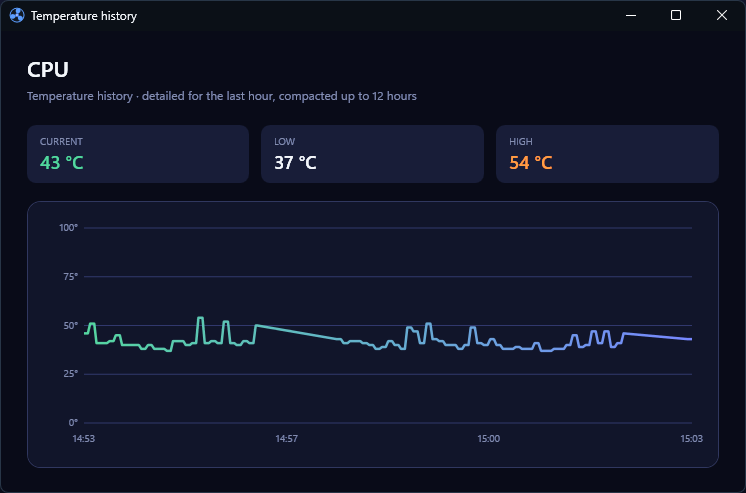

# Lenovo Desktop Fan Control

Lenovo Desktop Fan Control is a Windows desktop application for monitoring and controlling fans and tower lighting on supported Lenovo systems. It combines Lenovo WMI fan control with Windows Dynamic Lighting in a compact WPF dashboard built on .NET 10.




## Disclaimer

This is an unofficial, community-developed project and is not affiliated with, endorsed by, or supported by Lenovo. Lenovo and Legion are trademarks of Lenovo Group Limited.

Compatibility disclaimer: this application has only been tested on the 2025 Lenovo Legion T7 PC Tower. Other Lenovo models, years, hardware configurations, and firmware versions are untested and may not be supported.

Fan curves, firmware modes, and lighting controls interact with hardware through administrator-level WMI and Windows device APIs. Incorrect fan settings can reduce cooling performance, increase component temperatures, cause instability, or shorten hardware lifespan. Hardware behavior and firmware interfaces can vary between models and BIOS versions.

Use this software at your own risk. Monitor system temperatures, use conservative fan curves, and keep a supported recovery method available. The authors and contributors provide the software without warranty and are not responsible for hardware damage, data loss, instability, warranty impact, or other consequences arising from its use. See the [MIT License](LICENSE) for the full warranty and liability terms.

## Features

### Fan control

- Quiet, Balanced, Performance, and Custom SmartFan modes
- Live fan RPM and temperature monitoring
- GPU, CPU, SSD, and motherboard/system temperature cards with source details
- Clickable temperature-history charts, retaining detailed readings for one hour and compacted readings for up to twelve hours
- Shared Lenovo firmware sensors shown once in System Temperatures instead of repeated on every affected fan card
- Per-fan target speeds
- Interactive ten-point fan-curve editor
- Multi-channel telemetry grouped into logical fan zones
- Full-speed mode when supported by the firmware
- Automatic restoration of Balanced mode when the application exits from Custom mode

### Tower lighting

- Windows Dynamic Lighting/LampArray device discovery
- Lighting power and brightness controls
- Global color selection
- Independent power and color selection for detected lighting zones
- A persistent background host keeps the complete per-zone profile active when the UI closes
- Saved lighting preferences restored when the background host starts
- Windows 11 ambient background-lighting registration

### Desktop integration

- Start the lighting background host with Windows through an elevated logon task
- Minimize or close to the notification area; use the tray menu to exit
- Single-instance application behavior
- English, Finnish, Simplified Chinese, French, German, Spanish, Japanese, and Korean localization
- High-contrast palette support
- Administrator elevation through the application manifest
- Conflict detection for other fan-control applications

## Lighting Behavior

The application controls tower lighting through Windows LampArray. A hidden background host owns LampArray for the full user session; the interactive WPF window sends its lighting commands to that host through a local named pipe. Consequently, on supported ambient-lighting systems, opening or exiting the UI does not release the controller or cause a lighting reset, and the full per-zone profile remains active after the UI exits.

On Windows 11 build 23466 and later, the included sparse package identity registers the app as an ambient background-lighting controller so that its selected color can remain active while another window is in the foreground.

No Lenovo application or DLL is required by this project. If the exact supported controller (`VID 17EF`, `PID C955`) is present but Windows reports zero lamps, the application checks the firmware-provided `LENOVO_GAMEZONE_DATA` WMI interface. It enables Dynamic Lighting only when the firmware reports that the feature is supported and currently disabled, then retries Windows LampArray discovery. Controllers that do not match, already expose lamps, or report no firmware support are never modified.

The Lenovo OEM GeForce RTX 5080 (`10DE:2C02`, Lenovo subsystem `17AA:C770`) is exposed as a separate **Graphics Card** zone. Its static color, brightness, and power are controlled directly through the NVAPI library included with the NVIDIA display driver. This path is guarded by the exact PCI identity and does not require Lenovo Legion Space or Lenovo DLLs.

For a local source build, publish the app and register that exact output directory:

```powershell
dotnet publish LenovoDesktopFanControl -c Release -r win-x64 --self-contained false -o artifacts/background-lighting
powershell.exe -NoProfile -ExecutionPolicy Bypass -File .\tools\Install-BackgroundLighting.ps1 -ExternalLocation .\artifacts\background-lighting
.\artifacts\background-lighting\LenovoDesktopFanControl.exe
```

Approve the administrator prompt, then open **Settings > Personalization > Dynamic Lighting > Background light control** and move **Lenovo Desktop Fan Control** to the top of the priority list. Registration uses a local development certificate and applies only to the specified build output. Run `powershell.exe -NoProfile -ExecutionPolicy Bypass -File .\tools\Uninstall-BackgroundLighting.ps1` to stop the host and remove its startup task, identity, and certificate.

The registration script also signs the selected local app build. Once that development certificate exists, subsequent `dotnet build` and IDE builds are signed automatically so Windows Smart App Control does not block the rebuilt managed DLL.

The background host restores each saved zone's power, color, and brightness at host startup, including the supported GPU zone. This avoids relying on the controller's limited uniform firmware profile. Windows 10 treats LampArray control as foreground-only, so it cannot guarantee an active profile after the UI exits; use Windows 11 with the ambient background-lighting registration for persistent operation.

Enabling **Start with Windows** creates a user-specific Task Scheduler logon task with the highest available privileges and starts the hidden lighting host at sign-in. This avoids the delay and elevation limitations of an ordinary `Run` registry entry. Closing the window can still minimize it to the tray, while choosing **Exit** closes only the interactive UI—the background host continues managing lighting.

Debug builds use their own IPC names and never stop an installed Release host. A build requests that only the Debug background host exit so its output is unlocked. If the Debug UI is still open or minimized to the tray, the build stops with a clear message; choose **Exit** from the tray menu before rebuilding. To stop the Debug host manually, run:

```powershell
powershell.exe -NoProfile -ExecutionPolicy Bypass -File .\tools\Stop-BackgroundLighting.ps1
```

### Uninstalling a manual or ZIP deployment

Exit the interactive UI, then run the background-lighting uninstall script above. It stops the hidden host, removes the Task Scheduler entry, removes any legacy Run-key entry, unregisters the sparse package identity, and removes its development certificate. Afterwards, delete the application's installed folder manually.

An MSI is not required for this workflow. It is useful if you want a standard **Installed apps** entry and an uninstall action that also removes the application files automatically.

`WmiLightingService` is experimental and is not the active runtime backend. The tested controller rejects its undocumented firmware writes, so it should not be treated as a persistent-lighting solution yet.

## Compatibility and Requirements

- Windows 10 or Windows 11
- .NET 10 Desktop Runtime for the smaller framework-dependent ZIP; the Setup installer and self-contained ZIP include the runtime
- .NET 10 SDK to build from source
- A supported Lenovo desktop for real fan control
- A Windows LampArray-compatible Lenovo lighting controller for lighting control
- An NVIDIA display driver for lighting control on the supported Lenovo OEM RTX 5080
- Administrator privileges for Lenovo WMI operations
- The official signed [PawnIO](https://pawnio.eu/) driver is optional, but required for CPU and motherboard telemetry on systems that need low-level sensor access

Target framework: `net10.0-windows10.0.26100.0`.

Hardware support is detected at runtime. Unsupported systems show a clear status instead of attempting fan-control writes.

## Install a Release

Download the latest installer from [GitHub Releases](https://github.com/TuononenP/LenovoDesktopFanControl/releases). For most users, choose:

```text
LenovoDesktopFanControl-<version>-win-x64-Setup.exe
```

If the project does not yet have a trusted code-signing certificate, the filename is instead:

```text
LenovoDesktopFanControl-<version>-win-x64-Setup-unsigned.exe
```

The setup is self-contained, so it does not require a separate .NET runtime. It selects the Windows display language when supported and falls back to English. The installed application also supports English, Finnish, Simplified Chinese, French, German, Spanish, Japanese, and Korean.

Installation is per-user. Setup adds a Start Menu shortcut and a standard **Settings > Apps > Installed apps** entry. Uninstall stops the interactive application and lighting host, removes the user-specific startup registrations, and deletes the installed files.

On first launch, **Start with Windows** is enabled by default. This creates a user-specific elevated logon task for the hidden lighting host; it can be disabled from the application settings. Exiting the interactive UI does not stop that host, so the saved lighting profile remains active.

Unsigned releases can still be installed on Windows configurations that allow the user to approve an unrecognized publisher, but Windows may display a security warning and Smart App Control can block them. Verify the downloaded file against `SHA256SUMS.txt` on the same release page before running it.

## Build, Run, and Test

Clone the repository and open an elevated PowerShell terminal in its root directory.

```powershell
dotnet restore
dotnet build
dotnet run --project LenovoDesktopFanControl
dotnet test
```

The application manifest requests administrator elevation when the app starts. Release builds and tests can be run with:

```powershell
dotnet build -c Release
dotnet test -c Release
```

Build one self-contained, localized `Setup.exe` installer with a Windows **Installed apps** entry and uninstall support:

```powershell
dotnet build LenovoDesktopFanControl.Bundle\LenovoDesktopFanControl.Bundle.wixproj -c Release
```

The build writes `LenovoDesktopFanControl.Bundle\bin\Release\LenovoDesktopFanControl-Setup.exe`. Its WiX setup wizard selects the Windows display language when WiX provides it and otherwise falls back to English. It embeds one neutral MSI that contains the application's English, Finnish, Simplified Chinese, French, German, Spanish, Japanese, and Korean resources; the app selects and saves the matching Windows language at first launch. Each installation is per-user, so its background host, startup task, and uninstall action remain isolated from other user sessions. The installer creates a Start Menu shortcut and uses an embedded, packaged custom-action DLL to close the interactive UI, stop the actual host during maintenance, restart an existing host after install or repair, and remove startup registrations before uninstall deletes files. The elevated app creates or refreshes its user-specific **Start with Windows** task on first launch; the task grants that user removal rights so the per-user uninstaller can remove it without requiring MSI elevation. The setup wizard uses the application's dark blue/violet cooling artwork.

Only `Setup.exe` is distributed as the installer. Because it contains one self-contained MSI payload, it is roughly the size of one installer rather than eight (about 64 MiB in the current build). To build separate standalone localized MSIs for a special distribution, pass the desired culture list with `'-p:Cultures=en-US;fi-FI;zh-CN;fr-FR;de-DE;es-ES;ja-JP;ko-KR'` when building `LenovoDesktopFanControl.Installer.wixproj`.

Run the generated per-user setup normally:

```powershell
.\LenovoDesktopFanControl.Bundle\bin\Release\LenovoDesktopFanControl-Setup.exe
```

To remove it, use **Settings > Apps > Installed apps > Lenovo Desktop Fan Control > Uninstall**.

## Using the Application

1. Select a SmartFan mode and choose **Apply Mode**.
2. For manual control, select Custom mode, adjust a fan’s target speed, and choose **Apply Speed**.
3. Use **Edit Curve** to configure and apply a ten-point curve for an individual fan zone.
4. Click a System Temperatures card to view its temperature history. Shared motherboard/system sensors appear there once instead of on every fan card.
5. In Tower Lighting, enable the lights, select brightness and colors, then choose **Apply Lighting**.
6. On supported Windows 11 builds, register and prioritize the app for background lighting if the selected color should remain active while another app is in the foreground. The background host keeps the selected profile active after the UI exits.

Applying custom fan control changes firmware behavior. Monitor temperatures and use conservative curves appropriate for the installed hardware.

## Visual Test Mode

The built-in visual service provides deterministic fan telemetry without Lenovo fan hardware. Set the desired simulated fan count from 0 through 8 before launching:

```powershell
$env:LENOVO_FAN_CONTROL_VISUAL_TEST_FANS = "4"
dotnet run --project LenovoDesktopFanControl
```

Remove the variable to return to real WMI discovery:

```powershell
Remove-Item Env:LENOVO_FAN_CONTROL_VISUAL_TEST_FANS
```

Visual test mode simulates fan control. Lighting discovery still uses the configured lighting service.

## Settings and Logs

Application data is stored in:

```text
%LOCALAPPDATA%\LenovoDesktopFanControl\
|-- settings.json
`-- log.txt
```

`settings.json` contains fan curves, fan and system temperature histories, mode, language, startup/tray preferences, and lighting preferences. `log.txt` records hardware discovery, control operations, warnings, and errors.

If behavior is unexpected, close the application, inspect `log.txt`, and include the relevant entries with any bug report. Deleting `settings.json` resets application preferences to their defaults.

## Architecture

The application follows MVVM:

- Views define the WPF interface and forward user actions through bindings and commands.
- View models coordinate polling, commands, status, localization, and persistence.
- Services isolate WMI, the persistent LampArray host and UI proxy, settings, startup registration, logging, and native Windows behavior.
- Models represent firmware modes, fan telemetry, curves, settings, and lighting zones.

At startup, `MainWindow` selects either `VisualTestFanControlService` or `WmiFanControlService`, constructs `MainViewModel`, and initializes settings, lighting, firmware compatibility, and fan discovery. `MainViewModel` periodically refreshes telemetry and persists user configuration through `SettingsService`.

## Codebase Structure

```text
LenovoDesktopFanControl/
|-- LenovoDesktopFanControl.sln
|-- README.md
|-- LICENSE
|-- docs/
|   `-- images/                              README screenshots
|-- LenovoDesktopFanControl/                 WPF application
|   |-- App.xaml(.cs)                        Startup, single instance, accessibility
|   |-- MainWindow.xaml(.cs)                 Dashboard, tray, and window lifecycle
|   |-- app.manifest                         Elevation and sparse-package identity
|   |-- Assets/                              Application icon and generation script
|   |-- Models/
|   |   |-- ApplicationStatusKind.cs         UI connection and error states
|   |   |-- FanInfo.cs                       Fan and telemetry-channel data
|   |   |-- FanSettings.cs                   Persisted configuration model
|   |   |-- FanTable.cs                      Ten-point firmware fan curves
|   |   |-- LanguageInfo.cs                  Available UI languages
|   |   |-- LightingDeviceInfo.cs            Lighting devices, zones, and colors
|   |   `-- SmartFanMode.cs                  Firmware operating modes
|   |-- Services/
|   |   |-- IWmiFanControlService.cs         Fan-control abstraction
|   |   |-- WmiFanControlService.cs          Lenovo WMI fan discovery and control
|   |   |-- ILightingControlService.cs        Lighting abstraction
|   |   |-- LampArrayLightingService.cs      Host-owned Windows lighting backend
|   |   |-- LightingBackgroundHost.cs        Persistent LampArray owner and host lifecycle
|   |   |-- LightingHostProtocol.cs          Named-pipe protocol and host controller
|   |   |-- PipeLightingControlService.cs    UI proxy for the lighting host
|   |   |-- LenovoRtxGpuLightingController.cs Standalone Lenovo OEM RTX 5080 lighting
|   |   |-- DynamicLightingFirmwareRecovery.cs Guarded standalone lighting recovery
|   |   |-- WmiLightingService.cs            Experimental Lenovo lighting backend
|   |   |-- FanFirmwareCompatibility.cs      Model and firmware checks
|   |   |-- VisualTestFanControlService.cs   Simulated fan hardware
|   |   |-- SettingsService.cs               JSON persistence
|   |   |-- AutoStartService.cs              Windows startup registration
|   |   |-- LocalizationService.cs           Runtime localization
|   |   |-- NativeWindowTheme.cs             Native title-bar styling
|   |   |-- MotionPreferences.cs             Reduced-motion preferences
|   |   |-- VisualScaleVerifier.cs           Layout verification support
|   |   `-- Log.cs                           Local diagnostic logging
|   |-- ViewModels/
|   |   |-- MainViewModel.cs                 Application state and orchestration
|   |   |-- FanViewModel.cs                  Fan-zone control and summary
|   |   |-- FanChannelViewModel.cs           Individual telemetry channel
|   |   |-- LightingViewModel.cs             Lighting state and commands
|   |   `-- RelayCommand.cs                  MVVM command implementation
|   |-- Views/
|   |   |-- Controls/                        Fan cards, icon, and curve editor
|   |   |-- Converters/                      WPF binding converters
|   |   |-- Markup/                          Localization markup extension
|   |   `-- TrayMenuRenderer.cs              Notification-area menu rendering
|   |-- Themes/                              Colors, controls, and typography
|   `-- Resources/                           English, Finnish, Chinese, French, German, Spanish, Japanese, and Korean strings
|-- LenovoDesktopFanControl.Installer/       WiX MSI installer project
|   |-- LenovoDesktopFanControl.Installer.wixproj MSI build and application publish target
|   `-- Package.wxs                          Per-user MSI and host-cleanup uninstall actions
|-- LenovoDesktopFanControl.InstallerActions/ Embedded DTF custom-action project
|   `-- InstallerCustomActions.cs            Secure host lifecycle and task-cleanup actions
|-- LenovoDesktopFanControl.Bundle/          WiX Burn Setup.exe bundle
|   |-- LenovoDesktopFanControl.Bundle.wixproj Localized Setup.exe bundle build
|   `-- Bundle.wxs                           OS-language selection and chained MSI payloads
|-- Packaging/
|   `-- AppxManifest.xml                     Ambient background-lighting extension
|-- tools/
|   |-- Generate-InstallerFiles.ps1          Deterministic per-user MSI file components
|   |-- Install-BackgroundLighting.ps1       Local identity registration
|   |-- Sign-DevelopmentBuild.ps1            Local development-build signing
|   |-- Sign-ReleaseArtifacts.ps1            Authenticode release signing
|   |-- Stop-BackgroundLighting.ps1          Stops the lighting host before a build
|   `-- Uninstall-BackgroundLighting.ps1     Local identity removal
`-- LenovoDesktopFanControl.Tests/           xUnit test project
    |-- MainViewModelTests.cs                App orchestration and persistence
    |-- FanViewModelTests.cs                 Fan-zone behavior and commands
    |-- LightingViewModelTests.cs            Lighting behavior
    |-- ModelTests.cs                        Fan curves and settings models
    |-- SettingsServiceTests.cs              JSON persistence
    |-- WmiFanControlServiceTests.cs         WMI parsing helpers
    |-- ConverterTests.cs                    WPF converters
    `-- TestDoubles.cs                       In-memory service fakes
```

## Contributing

Keep hardware access behind service interfaces and UI logic in view models. Add regression tests for behavior changes, especially settings persistence, firmware writes, and error handling.

Before submitting changes:

```powershell
dotnet build -c Release
dotnet test -c Release
git diff --check
```

Do not commit generated `bin/` or `obj/` output, local settings, or logs.

## Releases

The release workflow in `.github/workflows/release.yml` restores the application and WiX projects, runs the complete test suite, builds the packaged installer custom action, validates the MSI with Windows Installer ICE checks, and publishes three Windows x64 artifacts:

- A smaller framework-dependent build that requires the .NET 10 Desktop Runtime
- A self-contained single-file build that includes the required runtime
- One self-contained, localized `Setup.exe` bundle with Windows **Installed apps** uninstall support

The release artifact also includes `SHA256SUMS.txt` for verifying every downloadable payload.

When `SIGNING_CERTIFICATE_BASE64` and `SIGNING_CERTIFICATE_PASSWORD` GitHub repository secrets are available, the release workflow signs the application executables, the internal MSI payload before it is bundled, and the final `Setup.exe` before generating the checksums. Without both secrets, it still publishes all three builds and appends `-unsigned` to each ZIP or executable filename, including `Setup-unsigned.exe`; users may see Windows security warnings or be blocked by Smart App Control. The job allows 60 minutes for installer validation, packaging, and upload headroom. Create a stable `major.minor.patch` tag to start a release:

```powershell
git tag v1.0.0
git push origin v1.0.0
```

The workflow can also be started manually from the GitHub Actions page by providing a version such as `1.0.0`. Manual runs create and push the corresponding tag after the build and tests succeed.

## Troubleshooting

### Fan control is unavailable

- Run the application as administrator.
- Confirm the machine is a supported Lenovo desktop.
- Close other fan-control applications reported by the conflict warning.
- Review `%LOCALAPPDATA%\LenovoDesktopFanControl\log.txt`.

### CPU or motherboard temperature is unavailable

- Install the official signed [PawnIO](https://pawnio.eu/) driver and restart the application.
- Run the application as administrator.
- Review the LibreHardwareMonitor sensor inventory in `%LOCALAPPDATA%\LenovoDesktopFanControl\log.txt`.
- Motherboard temperature normally requires a `System` or `Motherboard` sensor exposed by the board's Super I/O controller.
- On supported Lenovo desktops where no named board sensor is exposed, the app can display the shared firmware system sensor used by the chassis fans. Its source is labelled clearly in the UI.
- If neither source is available, the reading remains unavailable rather than guessing from an unrelated sensor.

### Lighting does not appear

- Confirm Windows Dynamic Lighting recognizes the device.
- Close applications that may already own the lighting controller.
- Restart the application and inspect LampArray discovery and firmware-recovery entries in `log.txt`.
- If the controller remains at zero lamps after recovery, reboot once so Windows can re-enumerate it with Dynamic Lighting enabled.

### Lighting changes when another app receives focus

On Windows 11 build 23466 or later, register the package identity, keep the application running, and prioritize **Lenovo Desktop Fan Control** under **Settings > Personalization > Dynamic Lighting > Background light control**. On Windows 10, LampArray control is foreground-only.

### Lighting changes after exit

On Windows 11 with the ambient registration, the interactive UI can exit without changing the lighting profile because the background host remains active. If the profile resets, confirm that `LenovoDesktopFanControl.exe --lighting-background` is running and review the background-host entries in `%LOCALAPPDATA%\LenovoDesktopFanControl\log.txt`.

### Settings behave unexpectedly

Exit the application and rename or delete `%LOCALAPPDATA%\LenovoDesktopFanControl\settings.json` to regenerate defaults.

## License

Licensed under the [MIT License](LICENSE).

## Third-party notices

The application includes [LibreHardwareMonitorLib 0.9.6](https://github.com/LibreHardwareMonitor/LibreHardwareMonitor) for CPU, SSD, and motherboard temperature telemetry. LibreHardwareMonitorLib is licensed under the [Mozilla Public License 2.0](https://www.mozilla.org/MPL/2.0/). Its corresponding source code and third-party notices are available from the linked project; this application does not modify that library. A copy of this notice is included with every application build as `THIRD-PARTY-NOTICES.md`.
