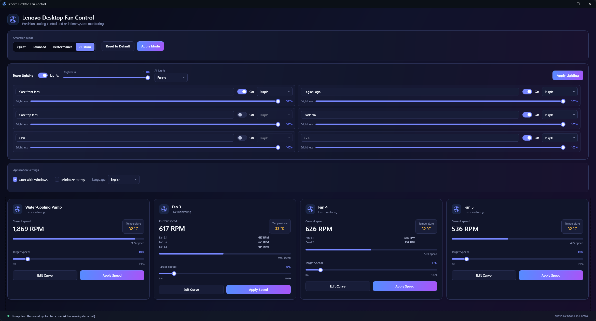
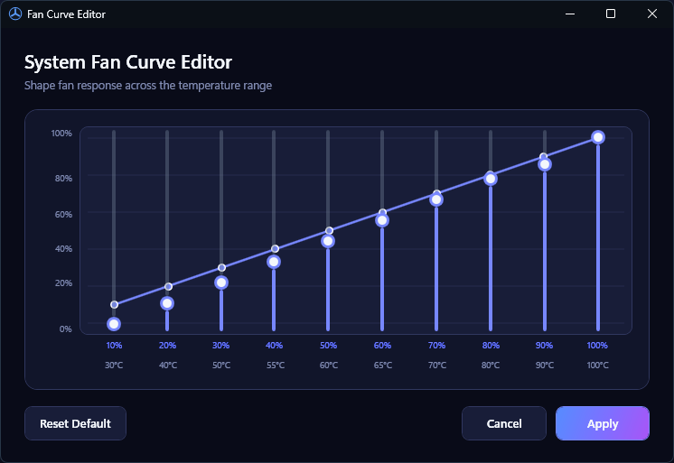

# Lenovo Desktop Fan Control

Lenovo Desktop Fan Control is a Windows desktop application for monitoring and controlling fans and tower lighting on supported Lenovo systems. It combines Lenovo WMI fan control with Windows Dynamic Lighting in a compact WPF dashboard built on .NET 10.





## Disclaimer

This is an unofficial, community-developed project and is not affiliated with, endorsed by, or supported by Lenovo. Lenovo and Legion are trademarks of Lenovo Group Limited.

Fan curves, firmware modes, and lighting controls interact with hardware through administrator-level WMI and Windows device APIs. Incorrect fan settings can reduce cooling performance, increase component temperatures, cause instability, or shorten hardware lifespan. Hardware behavior and firmware interfaces can vary between models and BIOS versions.

Use this software at your own risk. Monitor system temperatures, use conservative fan curves, and keep a supported recovery method available. The authors and contributors provide the software without warranty and are not responsible for hardware damage, data loss, instability, warranty impact, or other consequences arising from its use. See the [MIT License](LICENSE) for the full warranty and liability terms.

## Features

### Fan control

- Quiet, Balanced, Performance, and Custom SmartFan modes
- Live fan RPM and temperature monitoring
- Per-fan target speeds
- Interactive ten-point fan-curve editor
- Multi-channel telemetry grouped into logical fan zones
- Full-speed mode when supported by the firmware
- Automatic restoration of Balanced mode when the application exits from Custom mode

### Tower lighting

- Windows Dynamic Lighting/LampArray device discovery
- Lighting power and brightness controls
- Global color selection
- Independent color selection for detected lighting zones
- Saved lighting preferences restored at startup and when Windows grants lighting control
- Windows 11 ambient background-lighting registration

### Desktop integration

- Start with Windows
- Minimize to the notification area
- Single-instance application behavior
- English and Finnish localization
- High-contrast palette support
- Administrator elevation through the application manifest
- Conflict detection for other fan-control applications

## Lighting Behavior

The application controls tower lighting through Windows LampArray. An ordinary unpackaged LampArray app only controls lighting while it is in the foreground. On Windows 11 build 23466 and later, the included sparse package identity registers the app as an ambient background-lighting controller so that its selected color can remain active while another window is in the foreground.

No Lenovo application or DLL is required by this project. If the exact supported controller (`VID 17EF`, `PID C955`) is present but Windows reports zero lamps, the application checks the firmware-provided `LENOVO_GAMEZONE_DATA` WMI interface. It enables Dynamic Lighting only when the firmware reports that the feature is supported and currently disabled, then retries Windows LampArray discovery. Controllers that do not match, already expose lamps, or report no firmware support are never modified.

The Lenovo OEM GeForce RTX 5080 (`10DE:2C02`, Lenovo subsystem `17AA:C770`) is exposed as a separate **Graphics Card** zone. Its static color, brightness, and power are controlled directly through the NVAPI library included with the NVIDIA display driver. This path is guarded by the exact PCI identity and does not require Lenovo Legion Space or Lenovo DLLs.

For a local source build, publish the app and register that exact output directory:

```powershell
dotnet publish LenovoDesktopFanControl -c Release -r win-x64 --self-contained false -o artifacts/background-lighting
powershell.exe -NoProfile -ExecutionPolicy Bypass -File .\tools\Install-BackgroundLighting.ps1 -ExternalLocation .\artifacts\background-lighting
.\artifacts\background-lighting\LenovoDesktopFanControl.exe
```

Approve the administrator prompt, then open **Settings > Personalization > Dynamic Lighting > Background light control** and move **Lenovo Desktop Fan Control** to the top of the priority list. Registration uses a local development certificate and applies only to the specified build output. Run `powershell.exe -NoProfile -ExecutionPolicy Bypass -File .\tools\Uninstall-BackgroundLighting.ps1` to remove the identity and certificate.

Windows 10 supports foreground LampArray control only. Closing the process always releases the device, and Lenovo firmware may restore its own profile, commonly blue. Keep the registered application running or minimized in the notification area for background control.

`WmiLightingService` is experimental and is not the active runtime backend. The tested controller rejects its undocumented firmware writes, so it should not be treated as a persistent-lighting solution yet.

## Compatibility and Requirements

- Windows 10 or Windows 11
- .NET 10 Desktop Runtime to run a built application
- .NET 10 SDK to build from source
- A supported Lenovo desktop for real fan control
- A Windows LampArray-compatible Lenovo lighting controller for lighting control
- An NVIDIA display driver for lighting control on the supported Lenovo OEM RTX 5080
- Administrator privileges for Lenovo WMI operations

Target framework: `net10.0-windows10.0.26100.0`.

Hardware support is detected at runtime. Unsupported systems show a clear status instead of attempting fan-control writes.

## Build, Run, and Test

Clone the repository and open an elevated PowerShell terminal in its root directory.

```powershell
dotnet restore
dotnet build
dotnet run --project LenovoDesktopFanControl
dotnet test
```

The application manifest requests administrator elevation when the app starts. Release builds and tests can be run with:

```powershell
dotnet build -c Release
dotnet test -c Release
```

## Using the Application

1. Select a SmartFan mode and choose **Apply Mode**.
2. For manual control, select Custom mode, adjust a fan’s target speed, and choose **Apply Speed**.
3. Use **Edit Curve** to configure and apply a ten-point curve for an individual fan zone.
4. In Tower Lighting, enable the lights, select brightness and colors, then choose **Apply Lighting**.
5. On supported Windows 11 builds, register and prioritize the app for background lighting if the selected color should remain active while another app is in the foreground.

Applying custom fan control changes firmware behavior. Monitor temperatures and use conservative curves appropriate for the installed hardware.

## Visual Test Mode

The built-in visual service provides deterministic fan telemetry without Lenovo fan hardware. Set the desired simulated fan count from 0 through 8 before launching:

```powershell
$env:LENOVO_FAN_CONTROL_VISUAL_TEST_FANS = "4"
dotnet run --project LenovoDesktopFanControl
```

Remove the variable to return to real WMI discovery:

```powershell
Remove-Item Env:LENOVO_FAN_CONTROL_VISUAL_TEST_FANS
```

Visual test mode simulates fan control. Lighting discovery still uses the configured lighting service.

## Settings and Logs

Application data is stored in:

```text
%LOCALAPPDATA%\LenovoDesktopFanControl\
|-- settings.json
`-- log.txt
```

`settings.json` contains fan curves, mode, language, startup/tray preferences, and lighting preferences. `log.txt` records hardware discovery, control operations, warnings, and errors.

If behavior is unexpected, close the application, inspect `log.txt`, and include the relevant entries with any bug report. Deleting `settings.json` resets application preferences to their defaults.

## Architecture

The application follows MVVM:

- Views define the WPF interface and forward user actions through bindings and commands.
- View models coordinate polling, commands, status, localization, and persistence.
- Services isolate WMI, LampArray, settings, startup registration, logging, and native Windows behavior.
- Models represent firmware modes, fan telemetry, curves, settings, and lighting zones.

At startup, `MainWindow` selects either `VisualTestFanControlService` or `WmiFanControlService`, constructs `MainViewModel`, and initializes settings, lighting, firmware compatibility, and fan discovery. `MainViewModel` periodically refreshes telemetry and persists user configuration through `SettingsService`.

## Codebase Structure

```text
LenovoDesktopFanControl/
|-- LenovoDesktopFanControl.sln
|-- README.md
|-- LICENSE
|-- docs/
|   `-- images/                              README screenshots
|-- LenovoDesktopFanControl/                 WPF application
|   |-- App.xaml(.cs)                        Startup, single instance, accessibility
|   |-- MainWindow.xaml(.cs)                 Dashboard, tray, and window lifecycle
|   |-- app.manifest                         Elevation and sparse-package identity
|   |-- Assets/                              Application icon and generation script
|   |-- Models/
|   |   |-- ApplicationStatusKind.cs         UI connection and error states
|   |   |-- FanInfo.cs                       Fan and telemetry-channel data
|   |   |-- FanSettings.cs                   Persisted configuration model
|   |   |-- FanTable.cs                      Ten-point firmware fan curves
|   |   |-- LanguageInfo.cs                  Available UI languages
|   |   |-- LightingDeviceInfo.cs            Lighting devices, zones, and colors
|   |   `-- SmartFanMode.cs                  Firmware operating modes
|   |-- Services/
|   |   |-- IWmiFanControlService.cs         Fan-control abstraction
|   |   |-- WmiFanControlService.cs          Lenovo WMI fan discovery and control
|   |   |-- ILightingControlService.cs        Lighting abstraction
|   |   |-- LampArrayLightingService.cs      Active Windows lighting backend
|   |   |-- LenovoRtxGpuLightingController.cs Standalone Lenovo OEM RTX 5080 lighting
|   |   |-- DynamicLightingFirmwareRecovery.cs Guarded standalone lighting recovery
|   |   |-- WmiLightingService.cs            Experimental Lenovo lighting backend
|   |   |-- FanFirmwareCompatibility.cs      Model and firmware checks
|   |   |-- VisualTestFanControlService.cs   Simulated fan hardware
|   |   |-- SettingsService.cs               JSON persistence
|   |   |-- AutoStartService.cs              Windows startup registration
|   |   |-- LocalizationService.cs           Runtime localization
|   |   |-- NativeWindowTheme.cs             Native title-bar styling
|   |   |-- MotionPreferences.cs             Reduced-motion preferences
|   |   |-- VisualScaleVerifier.cs           Layout verification support
|   |   `-- Log.cs                           Local diagnostic logging
|   |-- ViewModels/
|   |   |-- MainViewModel.cs                 Application state and orchestration
|   |   |-- FanViewModel.cs                  Fan-zone control and summary
|   |   |-- FanChannelViewModel.cs           Individual telemetry channel
|   |   |-- LightingViewModel.cs             Lighting state and commands
|   |   `-- RelayCommand.cs                  MVVM command implementation
|   |-- Views/
|   |   |-- Controls/                        Fan cards, icon, and curve editor
|   |   |-- Converters/                      WPF binding converters
|   |   |-- Markup/                          Localization markup extension
|   |   `-- TrayMenuRenderer.cs              Notification-area menu rendering
|   |-- Themes/                              Colors, controls, and typography
|   `-- Resources/                           English and Finnish strings
|-- Packaging/
|   `-- AppxManifest.xml                     Ambient background-lighting extension
|-- tools/
|   |-- Install-BackgroundLighting.ps1       Local identity registration
|   `-- Uninstall-BackgroundLighting.ps1     Local identity removal
`-- LenovoDesktopFanControl.Tests/           xUnit test project
    |-- MainViewModelTests.cs                App orchestration and persistence
    |-- FanViewModelTests.cs                 Fan-zone behavior and commands
    |-- LightingViewModelTests.cs            Lighting behavior
    |-- ModelTests.cs                        Fan curves and settings models
    |-- SettingsServiceTests.cs              JSON persistence
    |-- WmiFanControlServiceTests.cs         WMI parsing helpers
    |-- ConverterTests.cs                    WPF converters
    `-- TestDoubles.cs                       In-memory service fakes
```

## Contributing

Keep hardware access behind service interfaces and UI logic in view models. Add regression tests for behavior changes, especially settings persistence, firmware writes, and error handling.

Before submitting changes:

```powershell
dotnet build -c Release
dotnet test -c Release
git diff --check
```

Do not commit generated `bin/` or `obj/` output, local settings, or logs.

## Releases

The release workflow in `.github/workflows/release.yml` runs the complete test suite and publishes two Windows x64 packages:

- A smaller framework-dependent build that requires the .NET 10 Desktop Runtime
- A self-contained single-file build that includes the required runtime

It also publishes `SHA256SUMS.txt` for integrity verification. Create a semantic-version tag to start a release:

```powershell
git tag v1.0.0
git push origin v1.0.0
```

The workflow can also be started manually from the GitHub Actions page by providing a version such as `1.0.0`. Manual runs create and push the corresponding tag after the build and tests succeed.

## Troubleshooting

### Fan control is unavailable

- Run the application as administrator.
- Confirm the machine is a supported Lenovo desktop.
- Close other fan-control applications reported by the conflict warning.
- Review `%LOCALAPPDATA%\LenovoDesktopFanControl\log.txt`.

### Lighting does not appear

- Confirm Windows Dynamic Lighting recognizes the device.
- Close applications that may already own the lighting controller.
- Restart the application and inspect LampArray discovery and firmware-recovery entries in `log.txt`.
- If the controller remains at zero lamps after recovery, reboot once so Windows can re-enumerate it with Dynamic Lighting enabled.

### Lighting changes when another app receives focus

On Windows 11 build 23466 or later, register the package identity, keep the application running, and prioritize **Lenovo Desktop Fan Control** under **Settings > Personalization > Dynamic Lighting > Background light control**. On Windows 10, LampArray control is foreground-only.

### Lighting changes after exit

LampArray control ends when the process exits. Enable minimize-to-tray and leave the application running if the selected profile must remain active.

### Settings behave unexpectedly

Exit the application and rename or delete `%LOCALAPPDATA%\LenovoDesktopFanControl\settings.json` to regenerate defaults.

## License

Licensed under the [MIT License](LICENSE).
